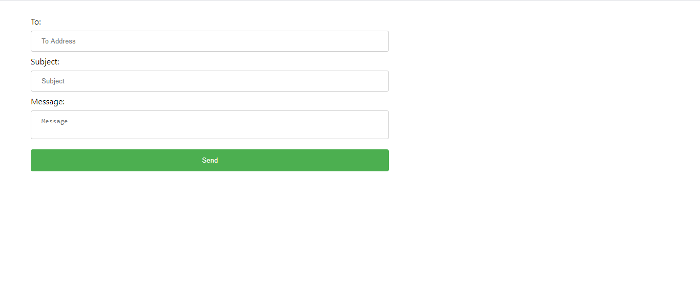
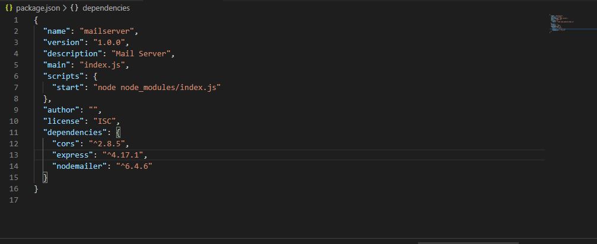
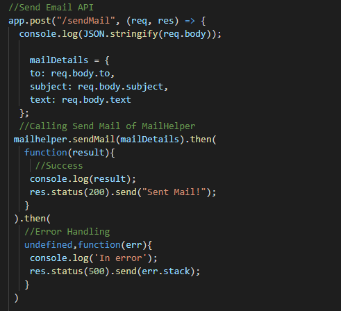
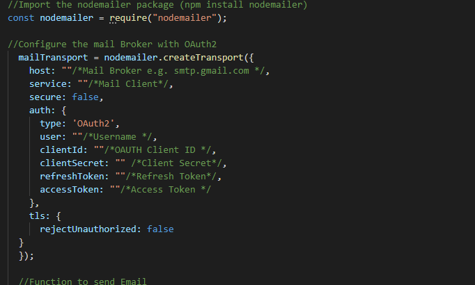
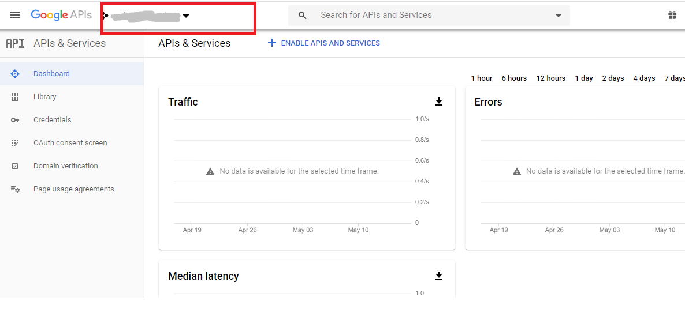
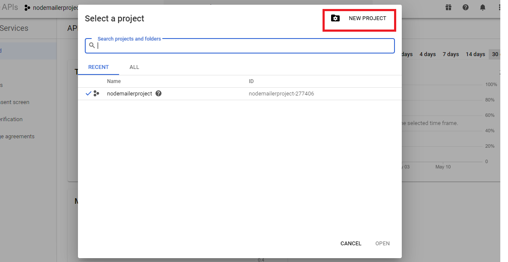
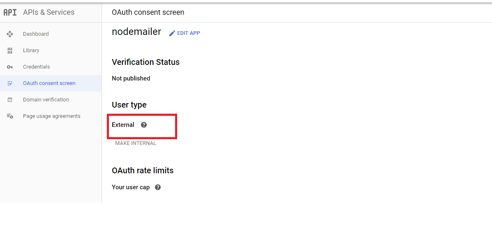
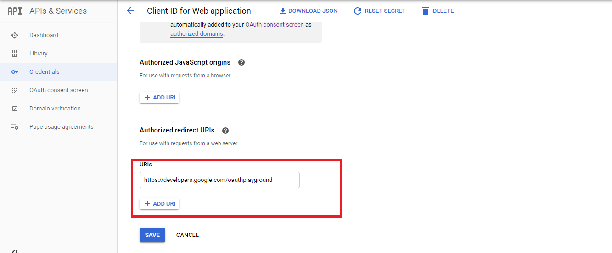
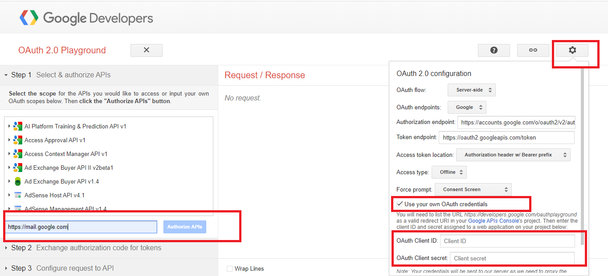
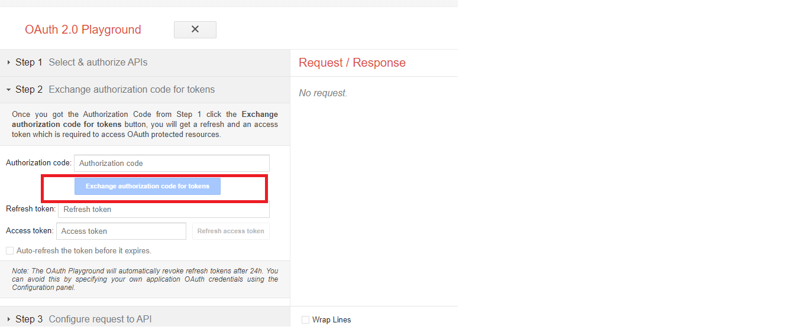

# NodeMailer Mail API with React and Express using Google Mail API

Nodemailer is a Node.js  module that allows to send email directly. 

This is a small learning project on how to use the Nodemailer api for programatically sending mails via your Google Mail Account using ReactJS and Express.

## Prerequisites

1. Node JS (https://nodejs.org/en/download/)
2. VisualStudio Code IDE (https://code.visualstudio.com/download)
3. Google Mail Account (https://mail.google.com)

## Installing

**Clone the project *MailServer* to your workspace.**

The Mail Server project consists of the necessary node packages for nodemailer, express and cors.

Below is an extract from how the package.json would look like.
*I have initialized my start script to index.js in my node_modules directory.*

The packages used can be installed seperately by running the npm install command.

The index.js file holds the controller for the API which calls indeed the functional component of nodemailer.

**Nodemailer can only be used on the server side. That is the reason why i have exposed the api to be used with React.**

The success and error messages are returned back from the api and an alert is displayed at the React application.

**The nodemailer api needs an initial setup for the authenticating with the mail broker.**

A mail broker is an agent which will provide with the necessary functionality with your mail server. For eg Gmail is a mail service and is providing its broker for use.

### Configuring Mail API using Google Developer Console

1. Log in with your google account to https://console.developers.google.com/apis/dashboard

Click on Google Dashboard as per the image below

2. Next step would be to create a new project

3. After creating a project navigate to the oauth consent screen tab. Google will require an authorization consent and you should
select a user type. *I have selected External user for my Project.*

4. Next step would be to create the client credentials for oauth and setting the redirect URI.

5. Click on credentials and you could see the client id and secret on the screen. If not click on create credentials and give the redirect URL as below  

### Setting API Playground

1. Navigate to https://developers.google.com/oauthplayground/ and click on the settings icon for oauth2 configuration.

2. Click on *Use your own OAuth credentials*.
	**Enter the client id and client secret obtained from the developer console**

3. Enter https://mail.google.com in the authorize api text box and click on authorize.

4. The page will redirect you to login your google account. After logging in Click on Exchange Authorization Code for tokens.

5. The refresh and access tokens for OAuth will be generated. Use it in the application.

### Configuring the React UI

**Clone the project *MailClient* to your workspace. The MailClient project contains the necesssary code for the react mail API client.**

Run npm install react to install all react node modules

On successful mail submission the message *Mail Sent Successfully* will be displayed.
On any errors the message *Error Sending Mail* will be thrown from the application and displayed in the UI.

## Authors

**Sarath Pillai** 

Connect @ https://www.linkedin.com/in/sarath-pillai-21bb85137/

